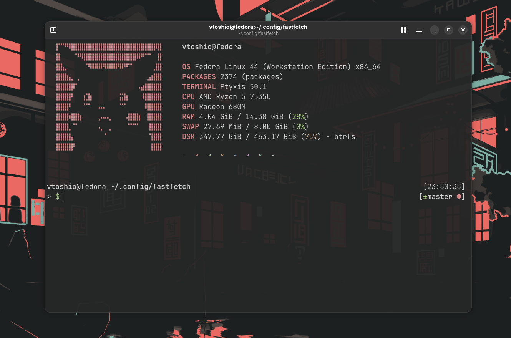

# Fastfetch

> Minha configuração do Fastfetch

## Preview



## Instalação

```bash
# Instalação do Fastfetch
sudo dnf install fastfetch 

# Adicionar o fastfetch na inicialização do Terminal
echo "fastfetch" >> ~/.zshrc  # Zsh
echo "fastfetch" >> ~/.bashrc # Bash

# Clonar as configurações
mkdir ~/.config/fastfetch
cd ~/.config/fastfetch
git clone https://github.com/vToshio/fastfetch-config.git
```
